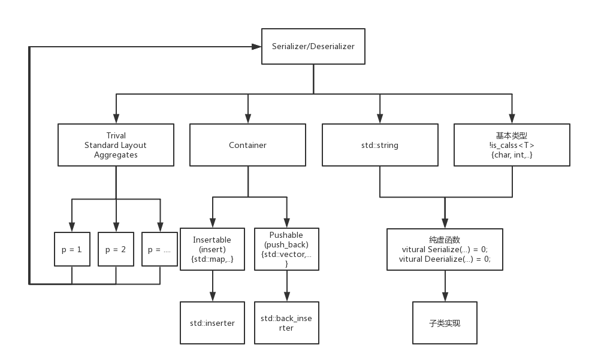

# Code Example
```c++
struct SomeStruct {
  int a;
  float b;
};
struct AnotherStruct {
  int a;
  double b;
  std::vector<SomeStruct> c;
  std::unordered_map<std::string, uint32_t> d;
  // ....
} another_struct;
// ... set another_struct
std::string str = SerializeToString(another_struct);
if (auto opb = ParseFromString<AnotherStruct>(str)) {
  // *opb is actualy equal to another_struct
}
```
* See more example [example.cpp](serialize/example.cpp) 
* If you want to realize you serialize alothgrim, please refer [baseline_serializer](serialize/baseline_serializer.h) and [baseline_deserializer](serialize/baseline_deserializer.h)

# Difference between other serialization

| Method                  |  cross-language    | modify code needed   | container supprot    | memory
|-------------------------|--------------------|----------------------|----------------------|------------|
| Troy                    | by your alothgrim  | no                   | yes | low
| Protobuf/Thrift         | yes                | need to write proto  | only vector and map (for proto3) | high
| boost serialization     | no                 | yes                  | no | low
| C#.NET framework        | only windows       | no                   | yes | low


# How To Install

## gcc-7.1

* for ubuntu 14.04

```bash
sudo add-apt-repository ppa:jonathonf/gcc-7.1
```
```bash
sudo apt-get install gcc-7
```
* for centos

```bash
 yum install gcc-7
```

* for installation package

[install gcc](https://gcc.gnu.org/) 

## bazel 

* Install JDK 8

* Install JDK 8 by using:

```bash
sudo apt-get install openjdk-8-jdk
```

* On Ubuntu 14.04 LTS you'll have to use a PPA:

```bash
sudo add-apt-repository ppa:webupd8team/java
```
```bash
sudo apt-get update && sudo apt-get install oracle-java8-installer
```

* Add Bazel distribution URI as a package source (one time setup)

```bash
echo "deb [arch=amd64] http://storage.googleapis.com/bazel-apt stable jdk1.8" | sudo tee /etc/apt/sources.list.d/bazel.list
```
```bash
curl https://bazel.build/bazel-release.pub.gpg | sudo apt-key add -
```

If you want to install the testing version of Bazel, replace stable with testing.

* Install and update Bazel

```bash
sudo apt-get update && sudo apt-get install bazel
```

* Once installed, you can upgrade to a newer version of Bazel with:

```bash
sudo apt-get upgrade bazel
```

*  More Documents about bazel

* [bazel](https://docs.bazel.build/versions/master/install-ubuntu.html)


## boost 

* for ubuntu 14.04

Run command

```bash
sudo apt-get install libboost-all-dev
```

Or you can call 

```bash
aptitude search boost
```

find packages you need and install them using the apt-get command.


* for installation package

[install boost](http://www.boost.org/users/download/) 


# Build And Test

## Build

```bash
bazel build ...
```

## Test

```bash
bazel test ...
```

# Structure of Troy


# C++17 Language Features Used in Troy

### Template argument deduction for class templates
Automatic template argument deduction much like how it's done for functions, but now including class constructors.
```c++
template <typename T = float>
struct MyContainer {
  T val;
  MyContainer() : val() {}
  MyContainer(T val) : val(val) {}
  // ...
};
MyContainer c1{ 1 }; // OK MyContainer<int>
MyContainer c2; // OK MyContainer<float>
```

### Structured bindings
A proposal for de-structuring initialization, that would allow writing `auto [ x, y, z ] = expr;` where the type of `expr` was a tuple-like object, whose elements would be bound to the variables `x`, `y`, and `z` (which this construct declares). _Tuple-like objects_ include `std::tuple`, `std::pair`, `std::array`, and aggregate structures.
```c++
using Coordinate = std::pair<int, int>;
Coordinate origin() {
  return Coordinate{0, 0};
}
const auto [ x, y ] = origin();
x; // == 0
y; // == 0
```

### Selection statements with initializer
New versions of the `if` and `switch` statements which simplify common code patterns and help users keep scopes tight.
```c++
{
  std::lock_guard<std::mutex> lk(mx);
  if (v.empty()) v.push_back(val);
}
// vs.
if (std::lock_guard<std::mutex> lk(mx); v.empty()) {
  v.push_back(val);
}
```
```c++
Foo gadget(args);
switch (auto s = gadget.status()) {
  case OK: gadget.zip(); break;
  case Bad: throw BadFoo(s.message());
}
// vs.
switch (Foo gadget(args); auto s = gadget.status()) {
  case OK: gadget.zip(); break;
  case Bad: throw BadFoo(s.message());
}
```

### constexpr if
Write code that is instantiated depending on a compile-time condition.
```c++
template <typename T>
constexpr bool isIntegral() {
  if constexpr (std::is_integral<T>::value) {
    return true;
  } else {
    return false;
  }
}
static_assert(isIntegral<int>() == true);
static_assert(isIntegral<char>() == true);
static_assert(isIntegral<double>() == false);
struct S {};
static_assert(isIntegral<S>() == false);
```

### std::optional
The class template `std::optional` manages an optional contained value, i.e. a value that may or may not be present. A common use case for optional is the return value of a function that may fail.
```c++
std::optional<std::string> create(bool b) {
  if (b) {
    return "Godzilla";
  } else {
    return {};
  }
}
```

# Acknowledgements
* [cppreference](http://en.cppreference.com/w/cpp) - especially useful for finding examples and documentation of new library features.
* [modern-cpp-features](https://github.com/AnthonyCalandra/modern-cpp-features)
modern cpp features for C++11/14/17

# Author
Qian Wang(cenrwang@tencent.com)

# License
Apache-2.0 license.

# TODO

## version control

* 版本控制，前向兼容

## protobuf / boost::archive alogthiom release

* protobuf 和 boost::archive 算法在troy上的实现

## verification interface

* 提供校验接口， 防止文件被污染或错读